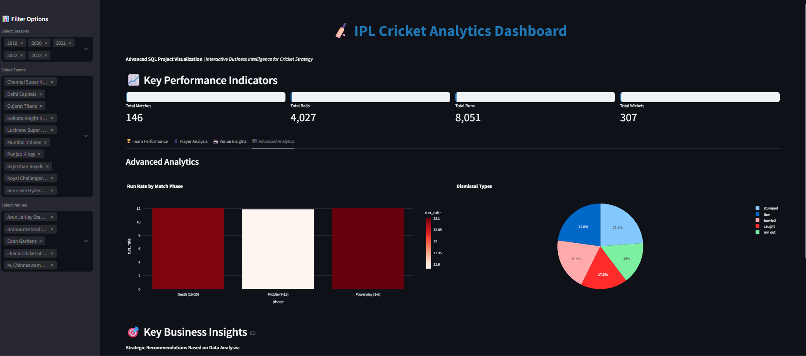
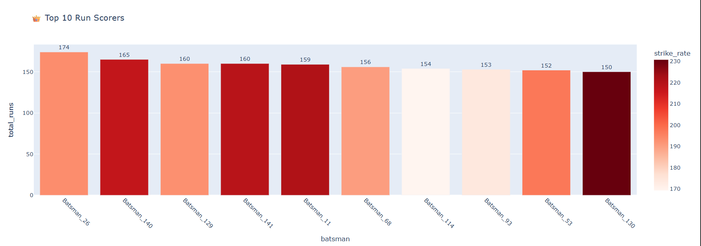
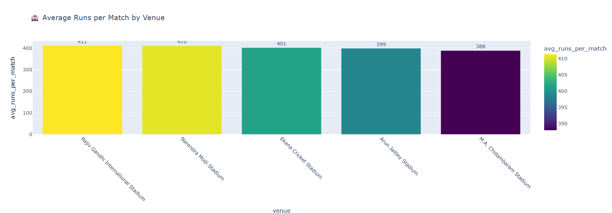

# IPL Cricket Analytics - SQL Project

## 🏏 Project Overview

This project demonstrates advanced SQL analytics capabilities using Indian Premier League (IPL) cricket data. It showcases comprehensive data analysis skills essential for business and data analyst roles, focusing on player performance, team strategies, venue insights, and match outcome predictions.



## 📊 Dataset Description

The project uses two main datasets:
- **matches.csv** (370 records): Match-level information including teams, venues, results, and outcomes
- **deliveries.csv** (10,097 records): Ball-by-ball data with player actions, runs, wickets, and dismissals

## 🎯 Business Questions Answered

1. **Player Performance**: Who are the most consistent batsmen and economical bowlers?
2. **Team Strategy**: Which teams perform best under pressure and at specific venues?
3. **Venue Analysis**: What are the characteristics of high-scoring vs low-scoring grounds?
4. **Toss Impact**: How much does winning the toss influence match outcomes?
5. **Market Insights**: Which players and teams provide the best entertainment value?

## 📁 Project Structure

```
ipl_cricket_analysis_SQL/
├── README.md                   # This file
├── LICENSE                     # MIT license
├── matches.csv                 # Match results and details
└── deliveries.csv              # Ball-by-ball data
├── schema_setup.sql            # Database schema and data loading
├── player_analysis.sql         # Batting and bowling performance metrics
├── team_performance.sql        # Team win-loss records and head-to-head
├── venue_analysis.sql          # Venue characteristics and advanced KPIs
└── advanced_kpis.sql           # Complex analytics and insights
|__ Example_images/ Query_1.png
                  / Query_2.png
                  / Dashboard.png
```

### Prerequisites
- PostgreSQL, MySQL, or SQLite
- Basic SQL knowledge
- CSV file import capability

### Setup Instructions

1. **Clone or Download** this project folder
2. **Create Database**:
   ```sql
   CREATE DATABASE ipl_analytics;
   USE ipl_analytics;
   ```

3. **Run Schema Setup**:
   ```bash
   # Execute the schema setup script
   psql -d ipl_analytics -f sql/01_schema_setup.sql
   ```

4. **Load Data**:
   - Modify file paths in `01_schema_setup.sql`
   - Load `matches.csv` and `deliveries.csv` using your preferred method

5. **Run Analysis Queries**:
   - Execute SQL files in order (02, 03, 04, 05)
   - Each file contains multiple analytical queries with business insights

## 📋 Sample Queries & Results

### Top Run Scorers with Strike Rate
```sql
SELECT batsman, SUM(batsman_runs) as total_runs,
       ROUND((SUM(batsman_runs) * 100.0) / COUNT(*), 2) as strike_rate
FROM deliveries 
GROUP BY batsman
HAVING COUNT(*) >= 50
ORDER BY total_runs DESC;
```


### Venue Batting vs Bowling Advantage
```sql
SELECT venue, 
       COUNT(CASE WHEN result = 'runs' THEN 1 END) * 100.0 / COUNT(*) as bat_first_win_pct
FROM matches
GROUP BY venue
HAVING COUNT(*) >= 5;
```

## 💼 Business Value

This project demonstrates:
- **Data-Driven Decision Making**: Using analytics to inform cricket strategy
- **KPI Development**: Creating meaningful metrics for performance evaluation
- **Trend Analysis**: Identifying patterns in player and team performance
- **Predictive Insights**: Using historical data to forecast outcomes
- **Stakeholder Communication**: Translating complex data into business insights

## 🎓 Skills Demonstrated

- **SQL Mastery**: Complex queries, optimization, and database design
- **Statistical Analysis**: Variance, correlation, and trend analysis
- **Business Intelligence**: KPI creation and performance measurement
- **Data Storytelling**: Converting numbers into actionable insights
- **Sports Analytics**: Domain-specific knowledge application

## 📊 Visualization Opportunities

While this project focuses on SQL analysis, the results can be easily integrated with:
- **Tableau/Power BI**: For interactive dashboards
- **Python/R**: For advanced statistical modeling
- **Excel**: For quick charts and stakeholder presentations

**Key Takeaway**: Cricket isn't just about individual brilliance—it's about understanding data patterns, venue characteristics, and strategic decision-making that can be measured and optimized through advanced SQL analytics.

---
